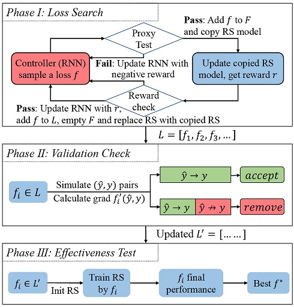

# AutoLossGen

This repository includes the implementation for paper "AutoLossGen: Automatic Loss Function Generation for Recommender Systems".

*Zelong Li, Jianchao Ji, Yingqiang Ge, Yongfeng Zhang. 2022. [AutoLossGen: Automatic Loss Function Generation for Recommender Systems](). In the Proceedings of the 45th International ACM SIGIR Conference on Research and Development in Information Retrieval (SIGIR '22)*

This package is mainly contributed by [Zelong Li](https://github.com/lzl65825) (zelong.li@rutgers.edu), [Yongfeng Zhang](https://github.com/evison) (yongfeng.zhang@rutgers.edu).
We welcome any issues and requests for model implementation and bug fix.

## Citation

If you use the code, please cite our [paper]():

```
@article{li2022autolossgen,
  title={AutoLossGen: Automatic Loss Function Generation for Recommender Systems},
  author={Li, Zelong and Ji, Jianchao and Ge, Yingqiang and Zhang, Yongfeng},
  journal={SIGIR},
  year={2022}
}
```

## Environments

Python 3.9.7

Necessary packages:

```
PyTorch==1.9.0
Numpy==1.20.3
scikit-learn==1.0.2
scipy==1.7.3
pandas==1.4.1
tqdm==4.62.3
```

## Example to run the codes

AutoLossGen has three phases. 

  

An example to run the first phase: Loss Search

```
python main.py --epoch 10000 --child_num_branches 9 --child_num_layers 10 --search_loss --gpu 0 --sample_branch_id --sample_skip_id --controller_num_aggregate 10 --controller_train_steps 10 --log_file ../log/log_0.txt --formula_path ../model/Formula_0.txt --train_with_optim --dataset ml100k01-1-5 --model_name BiasedMF --random_seed 42
```

Note: If the number of epochs is set too small, the performance may not good enough as the search is not throughout. 
We recommend a large number of epochs, and you can stop it manually. 

The second phase: Validation Check is run by 

```
python loss_valid_check.py
```

The file path and decode method are currently hard coded in this python file.

The last phase: Effectiveness Test. An example is:

```
python main.py --epoch 10000 --log_file ../log/log_1.txt --model_name BiasedMF --loss_func MaxR --metric AUC --dataset ml100k01-1-5 --smooth_coef 1e-6
```

## Reference

- We leveraged the dataset of [NCR](https://github.com/rutgerswiselab/NCR) projects to implement our experiment.
- We implemented our Controller part referring to [this project](https://github.com/TDeVries/enas_pytorch/), which is a PyTorch implementation of paper [Efficient Neural Architecture Search via Parameters Sharing](https://arxiv.org/abs/1802.03268).
